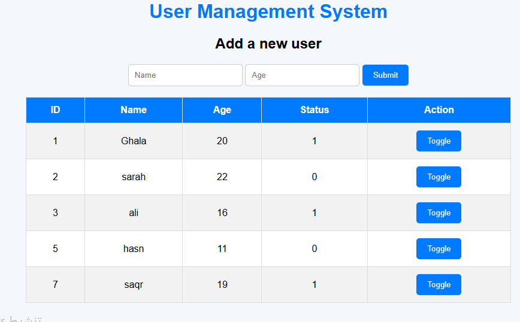

# User-Management-System
A simple user management system using HTML, CSS, JavaScript, PHP, and MySQL with AJAX toggle functionality.

# User Management System

## Project Description
This project is a simple web application developed using HTML, CSS, JavaScript, PHP, and MySQL.

The system allows users to:
- Add a new user.
- Store user information in a MySQL database.
- Display all users in a table.
- Toggle the user status between 0 and 1 without refreshing the page using AJAX.

---

## Technologies Used
- HTML
- CSS
- JavaScript
- PHP
- MySQL
- AJAX

---

## Project Files
- index.php
- insert.php
- toggle.php
- db.php
- style.css
- scriptt.js

---

## How to Run
1. Create the MySQL database.
2. Import the users table.
3. Update the database information in db.php.
4. Upload the project files to the server.
5. Open index.php in your browser.

---

## Features
- Add new users.
- Store data in MySQL.
- Display all records.
- Toggle status between 0 and 1 instantly.
- Responsive and clean interface.

---

## Screenshot

## Auther
Sarah Saud Alotaibi
